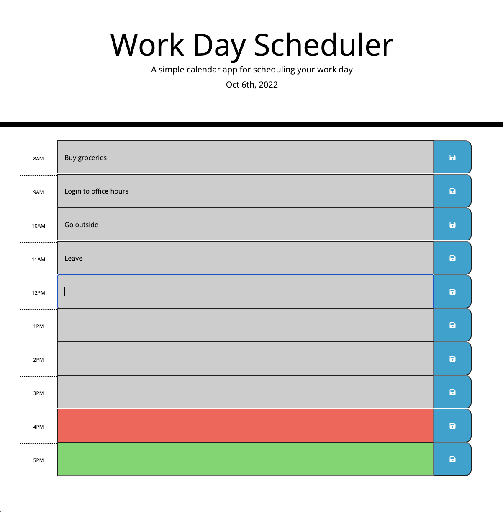

# work-day-scheduler

## Description 

This [Work Day Scheduler](mattdack.github.io/work-day-scheduler) provides an interface for users to enter and save events or tasks during work-day hours, save them, and reload the page to view them again. On page load the site updates the date. The background for each input section is updated with a background color to indicate whether the time slot is in the past, present, and future. The site utilizes moment.js, event listening, and local storage to achieve this functionality. The site is styled by bootstrap with additional custom styling.

## Screenshot of Webpage

## Installation

There is no installation required or capable with this repository. Running the index.html file in a default browser renders a landing page that presents the scheduler.

## Usage 

Users can select the grey, red, or green areas on the page and type any needed input. Clicking a save button at the end of the page will save the text in every single input area on the page. Reloading the page will render an updated date, backgrounds for each hour, 

## Credits

 Trilogy in collaboration with the University of Washington provided the initial HTML and CSS files. Matthew Dacanay completed these files and then wrote the entirety of the javascript functionality of this webpage. Technical concepts and public resources were referred to as needed. You can find other projects by Matthew at his [github page](github.com/mattdack).